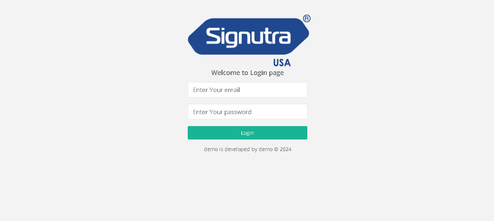
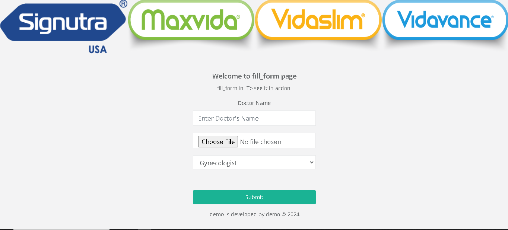
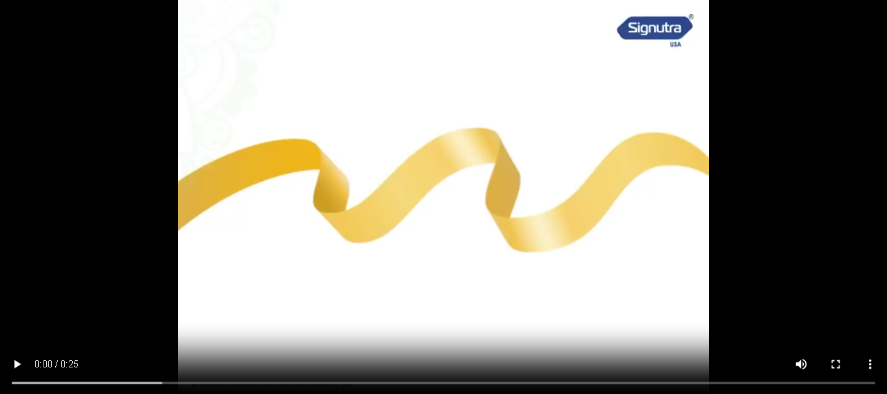
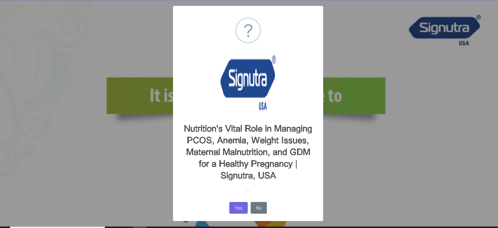
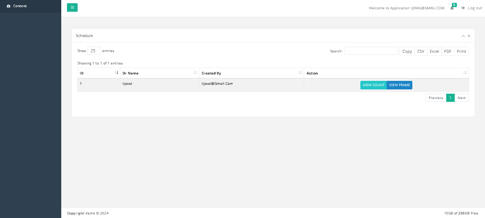
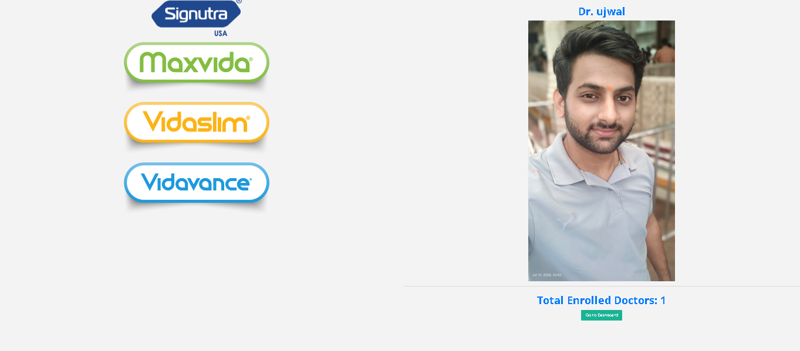
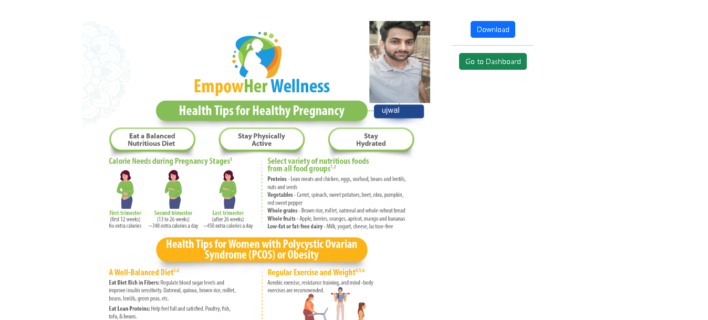

# TechMap









## Overview

TechMap is a Laravel-based application designed for doctors. It provides functionalities for logging in, uploading images and names, watching a video, and viewing or downloading certificates based on user interaction.

## Features

- Doctor login system
- Image and name upload functionality
- 30-second video playback
- Conditional navigation based on user interaction
- Dashboard view with view count
- Certificate download functionality

## Installation

### Prerequisites

Make sure you have the following installed on your machine:

- PHP >= 7.4
- Composer
- Laravel
- GD Library

### Steps

1. **Clone the repository**

```bash
git clone https://github.com/ujwaldangij/techmap.git
cd techmap
